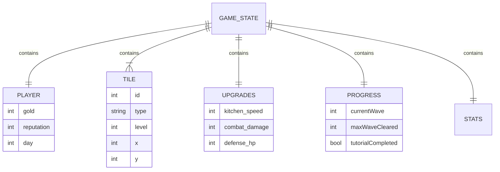

# 연습 프로젝트 #4: 게임 데이터 구조 설계

> **예상 소요 시간**: 2-3시간  
> **난이도**: ⭐⭐ (초급-중급)  
> **Tavern Defense 연관도**: ⭐⭐⭐⭐ (높음)

---

## 📌 프로젝트 개요

### 목표

Tavern Defense 게임의 **데이터 구조**를 미리 설계하고, CloudStorage 제한사항을 고려한 저장 시스템을 구현합니다.

### 왜 중요한가?

> **찰스**: "테이블 설계만 하면 되겠다."  
> (기술스택 명세서 v1.1)

게임 기획서가 나오기 전에 **데이터 구조의 뼈대**를 미리 잡아두면:

1. 기획서 확정 후 빠르게 구현 가능
2. CloudStorage 제한(4KB/값)에 맞는 설계 경험
3. 상태 관리 패턴 이해

---

## 📊 Tavern Defense 예상 데이터 구조

### 전체 게임 상태

```javascript
const gameState = {
  // 메타 정보
  version: "0.1.0",
  lastSaved: 1704067200000, // timestamp

  // 플레이어 정보
  player: {
    gold: 1000,
    reputation: 50,
    day: 1,
  },

  // 타일/건물 배치
  tiles: [
    { id: 1, type: "kitchen", level: 1, x: 0, y: 0 },
    { id: 2, type: "brewery", level: 2, x: 1, y: 0 },
    // ...
  ],

  // 업그레이드 상태
  upgrades: {
    kitchen_speed: 1,
    combat_damage: 2,
    defense_hp: 1,
  },

  // 진행 상태
  progress: {
    currentWave: 1,
    maxWaveCleared: 5,
    tutorialCompleted: true,
  },

  // 통계
  stats: {
    totalEnemiesKilled: 150,
    totalGoldEarned: 5000,
    totalDaysPlayed: 10,
  },
};
```

---

## 🗓️ 작업 계획 (2-3시간)

### Phase 1 (1시간): 데이터 구조 설계 문서

#### 작업 내용

```
□ 핵심 엔티티 정의 (Player, Tile, Enemy, Wave 등)
□ 각 엔티티 속성 정의
□ 엔티티 간 관계 정의
□ TypeScript 타입 정의 (선택)
□ Mermaid ER 다이어그램 작성
```

#### ER 다이어그램



---

### Phase 2 (1시간): 저장 시스템 구현

#### 작업 내용

```
□ SaveManager 클래스 설계
□ CloudStorage 제한 대응 (4KB/값)
□ 데이터 압축/분할 전략
□ 자동 저장 타이머
□ 버전 마이그레이션 로직
□ 개발 모드 폴백 (localStorage)
```

#### 핵심 코드

```javascript
// SaveManager.js
export class SaveManager {
  constructor() {
    this.saveKey = "tavern_defense_save";
    this.configKey = "tavern_defense_config";
    this.autoSaveInterval = 60000; // 1분
  }

  // 저장 (CloudStorage 제한 대응)
  async save(gameState) {
    const data = {
      version: gameState.version,
      lastSaved: Date.now(),
      ...gameState,
    };

    const jsonStr = JSON.stringify(data);

    // 4KB 제한 체크
    if (jsonStr.length > 4096) {
      console.warn("데이터 크기 초과, 분할 저장 필요");
      return this.saveChunked(data);
    }

    return await cloudStorage.setItem(this.saveKey, data);
  }

  // 분할 저장 (대용량 데이터용)
  async saveChunked(data) {
    const chunks = this.splitData(data);
    const promises = chunks.map((chunk, i) =>
      cloudStorage.setItem(`${this.saveKey}_${i}`, chunk)
    );

    // 청크 개수 저장
    await cloudStorage.setItem(`${this.saveKey}_meta`, {
      chunkCount: chunks.length,
    });

    return Promise.all(promises);
  }

  // 데이터 분할
  splitData(data) {
    const str = JSON.stringify(data);
    const chunkSize = 3500; // 여유 있게
    const chunks = [];

    for (let i = 0; i < str.length; i += chunkSize) {
      chunks.push(str.slice(i, i + chunkSize));
    }

    return chunks;
  }

  // 로드
  async load() {
    // 메타 데이터 확인
    const meta = await cloudStorage.getItem(`${this.saveKey}_meta`);

    if (meta?.chunkCount) {
      return this.loadChunked(meta.chunkCount);
    }

    return await cloudStorage.getItem(this.saveKey);
  }

  // 분할 로드
  async loadChunked(chunkCount) {
    const chunks = [];
    for (let i = 0; i < chunkCount; i++) {
      chunks.push(await cloudStorage.getItem(`${this.saveKey}_${i}`));
    }
    return JSON.parse(chunks.join(""));
  }

  // 버전 마이그레이션
  migrate(data, targetVersion) {
    const migrations = {
      "0.1.0": (d) => ({ ...d, newField: "default" }),
      "0.2.0": (d) => ({ ...d, anotherField: 0 }),
    };

    let current = data;
    while (current.version !== targetVersion) {
      const migrateFn = migrations[current.version];
      if (!migrateFn) break;
      current = migrateFn(current);
    }

    return current;
  }
}
```

---

### Phase 3 (30분-1시간): 테스트 페이지

#### 작업 내용

```
□ 간단한 테스트 UI 생성
□ 데이터 생성/저장/로드 버튼
□ 저장된 데이터 JSON 뷰어
□ 데이터 크기 표시
□ 압축률 확인
```

#### 테스트 UI

```html
<!DOCTYPE html>
<html>
  <head>
    <title>Tavern Defense - Data Test</title>
  </head>
  <body>
    <h1>📊 게임 데이터 테스트</h1>

    <section>
      <h2>데이터 생성</h2>
      <button onclick="generateTestData()">테스트 데이터 생성</button>
      <button onclick="generateLargeData()">대용량 데이터 생성</button>
    </section>

    <section>
      <h2>저장/로드</h2>
      <button onclick="saveData()">💾 저장</button>
      <button onclick="loadData()">📂 로드</button>
      <button onclick="clearData()">🗑️ 삭제</button>
    </section>

    <section>
      <h2>데이터 정보</h2>
      <p>크기: <span id="dataSize">-</span> bytes</p>
      <p>CloudStorage 제한: 4,096 bytes</p>
      <p>상태: <span id="status">-</span></p>
    </section>

    <section>
      <h2>JSON 뷰어</h2>
      <pre
        id="jsonViewer"
        style="background:#f5f5f5; padding:10px; overflow:auto; max-height:400px;"
      ></pre>
    </section>

    <script type="module" src="./test.js"></script>
  </body>
</html>
```

---

## 📁 프로젝트 구조

```
practice/game-data-design/
├── docs/
│   ├── data-model.md          # 데이터 모델 문서
│   ├── er-diagram.md          # ER 다이어그램
│   └── storage-strategy.md    # 저장 전략 문서
├── src/
│   ├── models/
│   │   ├── GameState.js       # 게임 상태 타입 정의
│   │   ├── Player.js          # 플레이어 모델
│   │   ├── Tile.js            # 타일 모델
│   │   └── constants.js       # 상수 정의
│   ├── storage/
│   │   ├── CloudStorage.js    # CloudStorage 래퍼
│   │   └── SaveManager.js     # 저장 관리자 ⭐
│   └── utils/
│       └── compression.js     # 데이터 압축 유틸
├── test/
│   ├── index.html             # 테스트 페이지
│   └── test.js                # 테스트 스크립트
└── README.md
```

---

## 📋 CloudStorage 제한 대응 전략

### 제한사항 정리

| 제한    | 값          | 대응             |
| ------- | ----------- | ---------------- |
| 키 길이 | 128자       | 간결한 키 네이밍 |
| 값 크기 | **4,096자** | 분할 저장        |
| 키 개수 | 1,024개     | 충분함           |

### 데이터 크기 추정

```javascript
// 예상 데이터 크기 계산
const estimatedSize = {
  meta: 50, // version, timestamp
  player: 100, // gold, reputation, day
  tiles: 50 * 20, // 20개 타일 × 50bytes
  upgrades: 200, // 여러 업그레이드
  progress: 100, // 진행 상태
  stats: 150, // 통계
  total: 1600, // 약 1.6KB
};

// 결론: 기본 세이브는 4KB 이내로 충분
// 타일 개수가 많아지면 분할 필요
```

### 압축 전략 (선택)

```javascript
// 키 축약 (약 30% 절약)
const compactState = {
  v: "0.1.0",        // version
  t: Date.now(),     // timestamp
  p: { g: 1000, r: 50, d: 1 },  // player: gold, reputation, day
  // ...
};

// 배열 축약
const tiles = [[1,"kitchen",1,0,0], [2,"brewery",2,1,0]];
// vs
const tiles = [
  { id: 1, type: "kitchen", level: 1, x: 0, y: 0 },
  ...
];
```

---

## 🎯 산출물 체크리스트

### 문서

- [ ] 데이터 모델 정의서 (data-model.md)
- [ ] ER 다이어그램 (Mermaid)
- [ ] 저장 전략 문서 (storage-strategy.md)

### 코드

- [ ] GameState 타입 정의
- [ ] SaveManager 클래스
- [ ] CloudStorage 래퍼
- [ ] 테스트 페이지

### 테스트

- [ ] 저장/로드 동작 확인
- [ ] 4KB 이상 데이터 분할 저장 확인
- [ ] 버전 마이그레이션 동작 확인

---

## 🔗 참고 자료

| 자료                  | URL                                                 |
| --------------------- | --------------------------------------------------- |
| CloudStorage API      | https://core.telegram.org/bots/webapps#cloudstorage |
| JSON 압축 라이브러리  | https://github.com/pieroxy/lz-string                |
| 게임 세이브 설계 패턴 | https://gameprogrammingpatterns.com/contents.html   |

---

## ✅ 완료 기준

1. 데이터 모델 문서 작성 완료
2. ER 다이어그램 Mermaid로 작성
3. SaveManager 클래스 구현
4. 분할 저장 로직 구현
5. 테스트 페이지에서 저장/로드 동작 확인
6. 4KB 초과 데이터 분할 저장 확인

---

## 💡 Tavern Defense 직접 적용

이 프로젝트의 산출물은 **그대로 복사**하여 사용 가능:

```
✅ models/GameState.js → src/data/GameState.js
✅ storage/SaveManager.js → src/data/SaveManager.js
✅ storage/CloudStorage.js → src/telegram/CloudStorage.js
```

---

_기획서가 확정되면 이 구조에 세부 내용만 추가하면 됩니다!_
